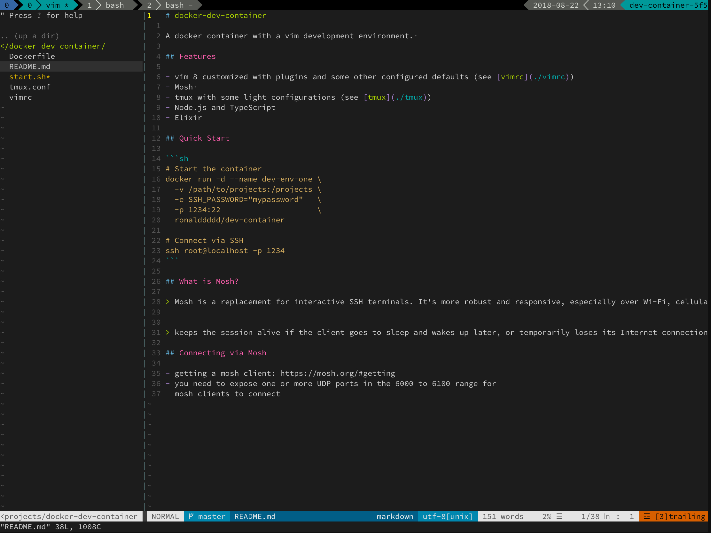

# docker-dev-container

A containerized vim development environment. 



## Why?

- vim is great :)
- portable development environment, just mount your projects directory
- great for pair programming: spin up a container, and `tmux a` into the same session! 

## Features

- vim 8 customized with plugins and some other configured defaults (see [vimrc](./vimrc))
- git
- Mosh 
- tmux with some light configurations (see [tmux](./tmux.conf))
- Node.js and TypeScript, eslint
- Elixir

## Quick Start

```sh
# Start the container
docker run -d --name dev-env-one \
  -v /path/to/projects:/projects \
  -e SSH_PASSWORD="mypassword"   \
  -p 1234:22                     \
  ronalddddd/dev-container

# Connect via SSH
ssh root@localhost -p 1234
```

## What is Mosh?

> Mosh is a replacement for interactive SSH terminals. It's more robust and responsive, especially over Wi-Fi, cellular, and long-distance links.


> keeps the session alive if the client goes to sleep and wakes up later, or temporarily loses its Internet connection

## Connecting via Mosh

```sh
mosh root@localhost -p 6000 --ssh="ssh -p 1234"
```

- getting a mosh client: https://mosh.org/#getting
- you need to expose one or more UDP ports in the 6000 to 6100 range for
  mosh clients to connect
